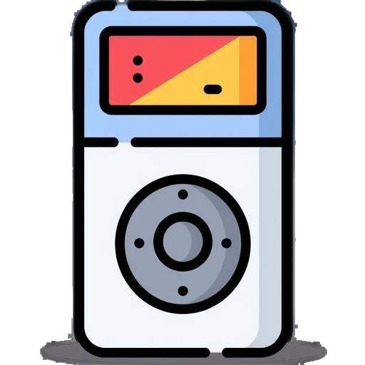

# openPod Tagger

<p align="center">
  
</p>

<p align="center">
  <strong>Automatically tag MP3 and FLAC files using acoustic fingerprinting</strong>
  <p>Note: Though this is an Electron app, I've not tested it in Windows, and due to metaflac CLI tool I used, it would not run on Windows. Mac OS? Don't know. Never tried, never will.</p>
</p>

<p align="center">
  <a href="#features">Features</a> •
  <a href="#installation">Installation</a> •
  <a href="#usage">Usage</a> •
  <a href="#building">Building</a> •
  <a href="#license">License</a>
</p>

## Features

- 🎵 **Acoustic Fingerprinting** - Identifies songs by their actual audio content using AcoustID (not filename!)
- 📝 **Automatic Tagging** - Writes metadata (title, artist, album, year, track number) to your files
- 🖼️ **Cover Art** - Fetches and embeds album artwork from Last.fm and MusicBrainz
- 📃 **Lyrics** - Downloads and saves lyrics from LRCLIB, ChartLyrics, and Genius
- 🌍 **Multi-language** - Supports English, Türkçe, Deutsch, Español, Français
- 🐧 **Linux Native** - Available as DEB package and AppImage
- ⚡ **Fast & Lightweight** - Built with Electron for a responsive desktop experience


## Installation

For .deb package: npx electron-builder --linux appimage -c.electronVersion=27.0.0
AppImage: npx electron-builder --linux deb -c.electronVersion=27.0.0 

### Ubuntu / Debian (DEB Package)

```bash
# Download the .deb file from releases
sudo dpkg -i openpod-tagger_1.0.0_amd64.deb
sudo apt-get install -f  # Fix dependencies
